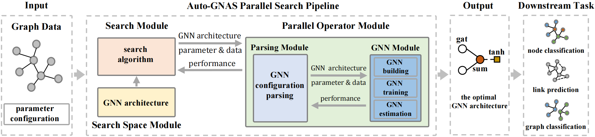

# Automatic Graph Neural Architecture Search

- Auto-GNAS is a general parallel graph neural architecture search framework for researchers and developers to achieve different tasks on graph.

- The framework of Auto-GNAS is as follows:

<br>
<div align=center>  </div>


## News

- 2022.02.10 Our work [*Auto-GNAS: A Parallel Graph Neural Architecture Search Framework*](https://ieeexplore.ieee.org/document/9714826) is accepted by **TPDS 2022**.


- 2021.04.15 Our work [*GraphPAS: Parallel Architecture Search for Graph Neural Networks*](https://arxiv.org/abs/2112.03461) is accepted by **SIGIR 2021**.

## Characters

#### 1. Highly customizable

  - Auto-GNAS supports user-defined almost all module functions easily.

#### 2. Parallel estimation
  - Auto-GNAS provides an interface for user-defined search algorithms to easily achieve parallel evaluation capabilities based on CPU or GPU. 
  

## Installing

- **Ensure you have installed CUDA 11.1 before installing other packages**

**1. Nvidia and CUDA 11.1:**

```python
(Nvidia)    https://www.nvidia.cn/Download/index.aspx?lang=cn
(CUDA 11.1) https://developer.nvidia.com/search?page=1&sort=relevance&term=cuda%20toolkit%2011.0

```

**2. Python environment:** recommending using Conda package manager to install

```python
conda create -n autognas python=3.7
source activate autognas
```

**3. Pytorch:** execute the following command in your conda env autognas

```python
pip3 install torch==1.8.2+cu111 torchvision==0.9.2+cu111 torchaudio==0.8.2 -f https://download.pytorch.org/whl/lts/1.8/torch_lts.html
```

**4. Pytorch Geometric:** execute the following command in your conda env autognas
```python
pip install torch-scatter torch-sparse torch-cluster torch-spline-conv torch-geometric -f https://data.pyg.org/whl/torch-1.8.0+cu111.html
```
**5. Ray:** execute the following command in your conda env autognas
```python
pip install ray
```


## Quick start

Users can refer to the following easy cases to understand how to:
- [*Define your graph data*](https://github.com/AutoMachine0/Auto-GNAS/blob/master/examples/graph_data_build/node_classification_graph_build.py)
- [*Define your configuration file*](https://github.com/AutoMachine0/Auto-GNAS/tree/master/config)
- [*Implement node classification task*](https://github.com/AutoMachine0/Auto-GNAS/blob/master/examples/node_classification.py)
- [*Implement graph classification task*](https://github.com/AutoMachine0/Auto-GNAS/blob/master/examples/graph_classification.py)
- [*Implement link prediction task*](https://github.com/AutoMachine0/Auto-GNAS/blob/master/examples/link_prediction.py)


## User-defined
Auto-GNAS is very friendly for users to implement customization, users can freely define their own functional components as long as they follow the **custom specification** and Auto-GNAS will automatically load user-defined components. Users can know the **custom specification** of each functional component in the following list, which is very simple. The list of definable components is as follows: 

**1. Search Space**

- [Attention](https://github.com/AutoMachine0/Auto-GNAS/tree/master/autognas/search_space/attention)
- [Aggregation](https://github.com/AutoMachine0/Auto-GNAS/tree/master/autognas/search_space/aggregation)
- [Multi-head number](https://github.com/AutoMachine0/Auto-GNAS/tree/master/autognas/search_space/multi_heads)
- [Hidden dimension](https://github.com/AutoMachine0/Auto-GNAS/tree/master/autognas/search_space/hidden_dimension)
- [Activation](https://github.com/AutoMachine0/Auto-GNAS/tree/master/autognas/search_space/activation)
- Layer number
    - user can defined this parameter in the [ini configuration file](https://github.com/AutoMachine0/Auto-GNAS/blob/master/config/node_classification_config/graphpas.ini) at the \[gnn_parameter] **gnn_layers** 

**2. [Search Algorithm](https://github.com/AutoMachine0/Auto-GNAS/tree/master/autognas/search_algorithm)**


**3. GNN Training**

- [optimizer function](https://github.com/AutoMachine0/Auto-GNAS/tree/master/autognas/model/optimizer_function)
- [loss function](https://github.com/AutoMachine0/Auto-GNAS/tree/master/autognas/model/loss_function)
- [evaluator function](https://github.com/AutoMachine0/Auto-GNAS/tree/master/autognas/model/evaluator_function)

**4. [Downstream Task Model](https://github.com/AutoMachine0/Auto-GNAS/tree/master/autognas/model/downstream_task_model)**

## API for Parallel Estimation 
Users can use the API to implement parallel evaluation capabilities for their own search algorithms

```python
from autognas.parallel import ParallelOperater,ParallelConfig

# obtain the user-defined graph data object
graph = UserCustomGraphData()

# open parallel estimation mode
ParallelConfig(True)

# initialize parallel operator object
parallel_estimation = ParallelOperater(graph)

# obtain multiple GNN architectures as a list from search algorithm
gnn_architecture_list = UserCustomSearchAlgorithm()

# obtain the parallel estimation result
parallel_result = parallel_estimation.estimation(gnn_architecture_list)
```

## API for GNN Search 
This is the top-level API of Auto-GNAS, users can use the default search algorithm to achieve different graph tasks

```python

import os
import configparser
from autognas.auto_model import AutoModel
from autognas.parallel import ParallelConfig
from autognas.datasets.planetoid import Planetoid

# open parallel estimation mode 
ParallelConfig(True)

# obtain graph object
graph = Planetoid("cora").data

# obtain gnn training and search algorithm configuration
config = configparser.ConfigParser()
config = os.path.abspath(os.path.join(os.getcwd(), "..")) + "/config/node_classification_config/graphpas.ini"

# obtain configuration dict
search_parameter = dict(config.items('search_parameter'))
gnn_parameter = dict(config.items("gnn_parameter"))

# automatic search the optimal gnn architecture and logging experiment result
AutoModel(graph, search_parameter, gnn_parameter)
```

## API for GNN Training
The API can help users realize the training and testing of GNN models for user-defined gnn architecture

```python
from autognas.model.stack_gcn import StackGcn
from autognas.datasets.planetoid import Planetoid

# obtain graph data object
graph = Planetoid("cora").data

# gnn architecture list 
architecture=['gcn', 'sum',  1, 64, 'tanh', 'gcn', 'sum', 1, 64, 'tanh']

# initialize GNN model object based on graph data and gnn architecture
model = StackGcn(graph_data=graph,gnn_architecture=architecture)

# gnn model training 
model.fit()

# gnn model testing
model.evaluate()
```

## Default Configuration

**1. Search Space**

| Architecture Component| Value |
|:-:|:-:|
| **Attention**       | gat / gcn / cos / const / sym-gat / linear / gene-linear|
| **Aggregation**      |mean / max / sum / min /softmax_sum |
| **Multi-head number** | 1 / 2 / 4 / 6 / 8|
| **Hidden Dimension**  | 8 / 16 / 32 / 64 / 128 / 256|
| **Activation**      | tanh / sigmoid / relu / linear / relu6 / elu / leaky_relu / softplus|

**2. Search Algorithm**

- [graphpas](https://github.com/AutoMachine0/Auto-GNAS/tree/master/autognas/search_algorithm/graphpas)
- [graphnas](https://github.com/AutoMachine0/Auto-GNAS/tree/master/autognas/search_algorithm/graphnas)
- [genetic search](https://github.com/AutoMachine0/Auto-GNAS/tree/master/autognas/search_algorithm/genetic)
- [random search](https://github.com/AutoMachine0/Auto-GNAS/tree/master/autognas/search_algorithm/random)

**3. GNN Training**

| Name| Value |
|:-:|:-:|
| **Optimizer function**   |adam |
| **loss function**       |nll_loss / binary_cross_entropy / binary_cross_entropy_with_logits / cross_entropy_loss |
| **evaluator function**    |accuracy / recall / f1 score / precision / roc_auc_score |


**4. Downstream Task Model** 

- [node classification](https://github.com/AutoMachine0/Auto-GNAS/blob/master/autognas/model/downstream_task_model/node_classification.py)
- [graph classification](https://github.com/AutoMachine0/Auto-GNAS/blob/master/autognas/model/downstream_task_model/graph_classification.py)
- [link prediction](https://github.com/AutoMachine0/Auto-GNAS/blob/master/autognas/model/downstream_task_model/link_prediction.py)


**5. Datasets**
```python

from autognas.datasets.planetoid import Planetoid

# node classification:cora; citeseer; pubmed for your configuration
graph = Planetoid(data_name="cora",train_splits=0.5, val_splits=0.3, shuffle_flag=True, random_seed=123).data 

# node classification:cora; citeseer; pubmed for default configuration
graph = Planetoid("cora").data

# graph classification: AIDS; BZR; COX2; DHFR; MUTAG; PROTEINS for your configuration
graph = Planetoid(data_name="AIDS",train_splits=0.6, val_splits=0.2, shuffle_flag=True, random_seed=55).data 

# graph classification: AIDS; BZR; COX2; DHFR; MUTAG; PROTEINS for default configuration
graph = Planetoid("ADIS").data

# link prediction: cora_lp; citeseer_lp; pubmed_lp for your configuration
graph = Planetoid(data_name="cora_lp",train_splits=0.6, val_splits=0.2, shuffle_flag=True, random_seed=55).data 

# link prediction: cora_lp; citeseer_lp; pubmed_lp for default configuration
graph = Planetoid("ADIS").data
```
   

## Citing
If you think Auto-GNAS is useful tool for you, please cite our paper, thank you for your support:

```
@ARTICLE{9714826,
  author={Chen, Jiamin and Gao, Jianliang and Chen, Yibo and Oloulade, Babatounde MOCTARD and Lyu, Tengfei and Li, Zhao},
  journal={IEEE Transactions on Parallel and Distributed Systems}, 
  title={Auto-GNAS: A Parallel Graph Neural Architecture Search Framework}, 
  year={2022},
  volume={},
  number={},
  pages={1-1},
  doi={10.1109/TPDS.2022.3151895}}
```

```
@inproceedings{chen2021graphpas,
  title={GraphPAS: Parallel Architecture Search for Graph Neural Networks},
  author={Chen, Jiamin and Gao, Jianliang and Chen, Yibo and Oloulade, Moctard Babatounde and Lyu, Tengfei and Li, Zhao},
  booktitle={Proceedings of the 44th International ACM SIGIR Conference on Research and Development in Information Retrieval},
  pages={2182--2186},
  year={2021}
}
```
