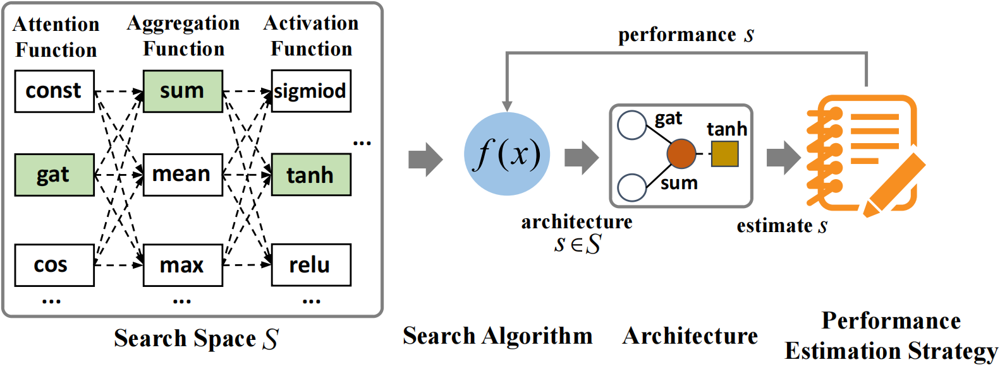

# Auto Graph Neural Architecture Search

- AutoGNAS is a general parallel graph neural architecture search framework for different tasks on graph dataset.

- AutoGNAS is developed based on [*GraphPAS: Parallel Architecture Search for Graph Neural Networks*](https://dl.acm.org/doi/abs/10.1145/3404835.3463007),Jiamin Chen,Jianliang Gao,Yibo Chen,Babatounde Moctard Oloulade,Tengfei Lyu,Zhao Li,**SIGIR 2021**

- AutoGNAS suports *Graph Convolutional Neural Network Architecture* design for node, link and graph embedding on current version. 

<br>
<br>
<br>
<div align=center> Illustration of Graph Convolutional Neurall Architecture Search </div>

## Characters

#### 1. Highly customizable

  - AutoGNAS supports user-defined almost all module functions

#### 2. Parallel estimation
  - AutoGNAS provides an interface for user-defined search algorithms to easily achieve parallel evaluation capabilities based on CPU or GPU 

#### 3. Multiple search algorithms
    
   - AutoGNAS supports four different default search algorithms:
     - [graphpas](https://dl.acm.org/doi/abs/10.1145/3404835.3463007)
     - [graphnas](https://arxiv.org/abs/1904.09981)
     - genetic search
     - random search

## Installing

- **Ensure you have installed CUDA 9.0 before installing other packages**

**1. Python environment:** recommending using Conda package manager to install

```json
conda create -n autognas python=3.6
source activate autognas
pip install scipy==1.1.0
pip install numpy==1.15.4
```

**2. Pytorch:**

```json
pip install torch==1.1.0 -f https://download.pytorch.org/whl/cu90/torch_stable.html
pip install torch-scatter==1.2.0
pip install torch-cluster==1.4.0
pip install torch-sparse==0.4.0
```

**3. Pytorch Geometric:**
```json
pip install torch_geometric==1.2.1
```
**4. Ray:**
```json
pip install ray==1.2.0
```
**5. Scikit Learn:**
```json
pip install scikit_learn==0.21.3
```
## Quick start
- [*Define your graph data*](https://github.com/AutoMachine0/Auto-GNAS/blob/master/examples/graph_data_build/node_classification_graph_build.py)
- [*Node classification task*](https://github.com/AutoMachine0/Auto-GNAS/blob/master/examples/node_classification.py)
- [*Graph classification task*](https://github.com/AutoMachine0/Auto-GNAS/blob/master/examples/graph_classification.py)
- [*Define your configuration file*](https://github.com/AutoMachine0/Auto-GNAS/tree/master/config/node_classification_config)

## Customization

**1. Search Space**

- Attention
- Aggregation
- Multi-head number
- Hidden dimension
- Activation
- Layer number

**2. Search Algorithm**


**3. GNN Training**

- optimizer function
- loss function
- evaluator function

**4. Downstream Task Model**


## API for Parallel estimation 
```python
from autognas.parallel import ParallelOperater,ParallelConfig

# obtain the user-defined graph data object
graph = UserCustomGraphData()

# open parallel estimation mode
ParallelConfig(True)

# initialize parallel operator object
parallel_estimation = ParallelOperater(graph)

# obtain multiple GNN architectures as a list from search algorithm
gnn_architecture_list = UserCustomSearchAlgorithm()

# obtain the parallel estimation result
parallel_result = parallel_estimation.estimation(gnn_architecture_list)
```

## API for GNAS
```python

import os
import configparser
from autognas.auto_model import AutoModel
from autognas.parallel import ParallelConfig
from autognas.datasets.planetoid import Planetoid

# open parallel estimation mode 
ParallelConfig(True)

# obtain graph object
graph = Planetoid("cora").data

# obtain gnn training and search algorithm configuration
config = configparser.ConfigParser()
config = os.path.abspath(os.path.join(os.getcwd(), "..")) + "/config/node_classification_config/graphpas.ini"

# obtain configuration dict
search_parameter = dict(config.items('search_parameter'))
gnn_parameter = dict(config.items("gnn_parameter"))

# automatic search the optimal gnn architecture and logging experiment result
AutoModel(graph, search_parameter, gnn_parameter)
```

## API for GNN 
```python
from autognas.model.stack_gcn import StackGcn
from autognas.datasets.planetoid import Planetoid

# obtain graph data object
graph = Planetoid("cora").data

# gnn architecture list 
architecture=['gcn', 'sum',  1, 64, 'tanh', 'gcn', 'sum', 1, 64, 'tanh']

# initialize GNN model object based on graph data and gnn architecture
model = StackGcn(graph_data=graph,gnn_architecture=architecture)

# gnn model training 
model.fit()

# gnn model testing
model.evaluate()
```

## Default configuration
**1. Search Space**

| Architecture Component| Value |
|:-:|:-:|
| **Attention**       | gat / gcn / cos / const / sym-gat / linear / gene-linear|
| **Aggregation**      |mean / max / sum |
| **Multi-head number** | 1 / 2 / 4 / 6 / 8|
| **Hidden Dimension**  | 8 / 16 / 32 / 64 / 128 / 256|
| **Activation**      | tanh / sigmoid / relu / linear / relu6 / elu / leaky_relu / softplus|

**2. Search Algorithm**

- [graphpas](https://github.com/AutoMachine0/Auto-GNAS/tree/master/autognas/search_algorithm/graphpas)
- [graphnas](https://github.com/AutoMachine0/Auto-GNAS/tree/master/autognas/search_algorithm/graphnas)
- [genetic search](https://github.com/AutoMachine0/Auto-GNAS/tree/master/autognas/search_algorithm/genetic)
- [random search](https://github.com/AutoMachine0/Auto-GNAS/tree/master/autognas/search_algorithm/random)

**3. GNN Training**

| Name| Value |
|:-:|:-:|
| **Optimizer function**   |adam |
| **loss function**       |nll_loss|
| **evalutor function**    |accuracy / recall / f1 score / precision |


**4. Downstream Task Model** 

- [node classification](https://github.com/AutoMachine0/Auto-GNAS/blob/master/autognas/model/downstream_task_model/node_classification.py)
- [graph classification](https://github.com/AutoMachine0/Auto-GNAS/blob/master/autognas/model/downstream_task_model/graph_classification.py)


**5. Datasets**
```python

from autognas.datasets.planetoid import Planetoid

# node classification cite network:cora; citeseer; pubmed
graph = Planetoid("cora").data 

# graph classification protein network: ENZYMES
graph = Planetoid("ENZYMES").data 
```
   

## Citing
If you think AutoGNAS is useful tool for you, please cite our paper, thank you for your support:
```
@inproceedings{chen2021graphpas,
  title={GraphPAS: Parallel Architecture Search for Graph Neural Networks},
  author={Chen, Jiamin and Gao, Jianliang and Chen, Yibo and Oloulade, Moctard Babatounde and Lyu, Tengfei and Li, Zhao},
  booktitle={Proceedings of the 44th International ACM SIGIR Conference on Research and Development in Information Retrieval},
  pages={2182--2186},
  year={2021}
}
```
